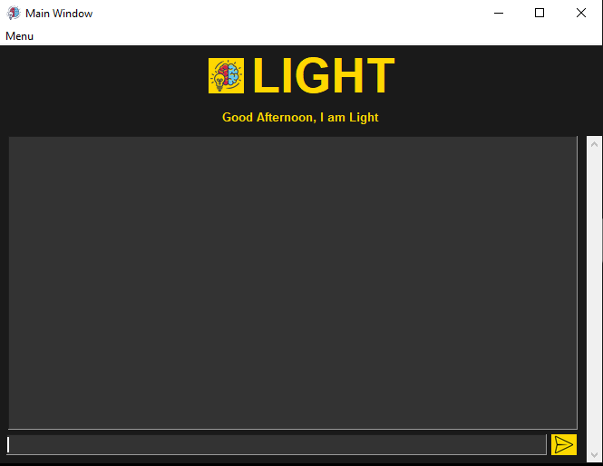

[](https://github.com/AniruddhaGawali/light)

This is light a chatbot based on artificial intelligence. It's a great project make by python with help of tkinter and chatterbot module,its easy and simple UI with a contrastic black and gold colour. Ita also contain some command that will help in your work. 

its still in developing, its an first genration of it. Some more add on to it when it will develpded more but still it can be test and its is userfrindly to used not much to thing for used it.


------------


- ### Feature:
	- Better chat bot based on chatterbot
	- Some opreations can also be done
	- Great ui of black and yellow contrast

- ### Some commads/ Chats:
	- Open google
	- Open wiki
	- Play music
	- Hi,how are you
	- Which is your favorite game
	etc.....
	
- ### Installation:

	- ##### Download 
	
		 - Download the repositorie by download button given below
		 
			 [](https://github.com/AniruddhaGawali/light/archive/master.zip)	
			 
		**OR**
		
		 - Download by github by using command
		 
			 ```bash
			git clone https://github.com/AniruddhaGawali/light

			 ```
		 - ###### And unzip the downloaded folder 
		 
	- ##### Installing Modules:
	
		- open cmd/powershell as admin
		
		- go to the downloded folder 
		
		- add commad for admin activate
			```bash
			Set-ExecutionPolicy Unrestricted -Force
			```
		
		- Add commad to activate the enviroment
			```bash
			.\\light\Scripts\activate
			```
		
		- Download module
			```bash
			pip install -r requirements.txt
			```
		
	- ##### Run
		```bash
		light.py 
		```


------------


- ### What is AI (Artificial Intelligence):

	A machine with the ability to perform cognitive functions such as perceiving, learning, reasoning and solve problems are deemed to hold an artificial intelligence. Artificial intelligence exists when a machine has cognitive ability. The benchmark for AI is the human level concerning reasoning, speech, and vision

- ### About Chatterbot:
	 ChatterBot is a machine-learning based conversational dialog engine build in Python which makes it possible to generate responses based on collections of known conversations. The language independent design of ChatterBot allows it to be trained to speak any language.
	 
	 To know more about it visit [Chatterbot Repo](https://github.com/gunthercox/ChatterBot)
	 
- ### Some Screenshots:
	[](https://github.com/AniruddhaGawali/light/blob/master/data/img/img2.png)
	
	
	
	[](https://github.com/AniruddhaGawali/light/blob/master/data/img/img1.png)
	
	
	
	[](https://github.com/AniruddhaGawali/light/blob/master/data/img/img3.png)
	
	

